# 🔄 **Pharmonico — End-to-End Data Flow Sequence (High-Level Architecture)**

## **1. Prescription Intake (NCPDP Data Enters System)**

1. **Provider submits a prescription**

   * Real world: eRx → NCPDP SCRIPT
   * Pharmonico: Mock data or Gemini-generated NCPDP-like payload

2. **API receives the prescription**

   * `POST /api/intake`
   * API stores prescription in **MongoDB**
   * Prescription status = `"received"`

3. **API emits Kafka event**

   * Topic: `intake_received`
   * Message contains:

     * prescription_id
     * patient_id
     * raw NCPDP payload

---

## **2. Validation Worker Processes Intake**

4. **Worker consumes `intake_received` event**

   * Parses NCPDP
   * Validates:

     * NPI, NDC, SIG
     * patient name/DOB consistency
     * required fields

5. Depending on result:

   * If valid → MongoDB status = `"validated"`
   * If issues → MongoDB status = `"validation_issue"`

6. Worker emits:

   * If valid: Kafka `prescription_validated`
   * If invalid: no further workflow (Ops manually handles it)

---

## **3. Enrollment Flow (Patient Action Required)**

7. **API generates magic link**

   * Called when Ops clicks “Start Enrollment”
   * Stores token in **Redis**
   * Sends email via **Maildev** (dev mode)

8. **Patient opens magic link**

   * Frontend fetches enrollment metadata via API
   * Token verified from Redis

9. **Patient enters insurance info**

   * Upload insurance card images → stored in **MinIO**
   * Accepts consent (HIPAA-like)
   * Submits enrollment

10. **API updates MongoDB**

    * status = `"awaiting_routing"`

11. **API emits Kafka event**

    * Topic: `enrollment_completed`

---

## **4. Pharmacy Routing Logic**

12. **Routing Worker consumes `enrollment_completed`**

    * Fetches:

      * patient location
      * insurance plan
      * medication type
    * Filters + scores pharmacies from MongoDB

13. **Worker updates MongoDB**

    * Attaches recommended pharmacy list
    * status = `"awaiting_pharmacy_selection"`

14. **Ops selects pharmacy**

    * UI writes selected pharmacy → MongoDB
    * API emits Kafka event: `pharmacy_selected`

---

## **5. Insurance Adjudication Simulation**

15. **Adjudication Worker consumes `pharmacy_selected`**

    * Calls mock adjudication API
    * Computes patient copay, insurance coverage, coupon values

16. **Worker writes adjudication result → MongoDB**

    * status = `"adjudicated"`
    * copay amount stored

17. **Worker emits Kafka event**

    * Topic: `payment_link_required`

---

## **6. Payment Flow**

18. **API receives event, creates Stripe payment link**

    * Saves link + session ID to MongoDB

19. **Patient receives email/SMS with payment link**

    * Uses Stripe → pays

20. **Stripe webhook calls API**

    * `/webhook/stripe`
    * API verifies signature
    * Updates MongoDB:

      * status = `"paid"`

21. **API emits Kafka event**

    * `payment_successful`

---

## **7. Shipping + Fulfillment**

22. **Shipping Worker consumes `payment_successful`**

    * Calls Shippo to create shipping label
    * Saves tracking number to MongoDB
    * status = `"shipped"`

23. **Worker emits Kafka event**

    * `shipping_label_generated`

24. **Delivery tracking loop**

    * Worker regularly polls Shippo
    * Updates status:

      * `"in_transit"`
      * `"out_for_delivery"`
      * `"delivered"`

---

## **8. Final Delivery**

25. **Once Shippo shows “delivered”:**

    * MongoDB status = `"completed"`
    * Send final notification email/SMS to patient
    * Write audit log entry → PostgreSQL

---

# 🧭 **Full Sequence (Condensed Form)**

```
Intake API → MongoDB (received)
          → Kafka: intake_received
Worker (validation) → MongoDB (validated)
                   → Kafka: prescription_validated
Ops → Start Enrollment → Redis token → Maildev email
Patient → Enrollment Portal → MinIO uploads
API → MongoDB (awaiting_routing)
    → Kafka: enrollment_completed
Worker (routing) → MongoDB recommendations
Ops selects pharmacy → MongoDB
                    → Kafka: pharmacy_selected
Worker (adjudication) → MongoDB (adjudicated)
                     → Kafka: payment_link_required
API → Stripe payment link → MongoDB
Stripe webhook → API → MongoDB (paid)
               → Kafka: payment_successful
Worker (shipping) → Shippo label → MongoDB (shipped)
Delivery polling worker → MongoDB updates
→ Final: "completed"
Audit logs → PostgreSQL
Notifications → Maildev
```

---

# 🏁 **End Result**

 **full architecture-level sequence of how data flows across services**

* **API server**
* **Kafka event bus**
* **Workers**
* **MongoDB**
* **Redis**
* **PostgreSQL**
* **MinIO**
* **Third-party integrations**

---

#  **FlowChart Diagram**

```mermaid
flowchart TD

%% ========================================
%% STYLE DEFINITIONS
%% ========================================
classDef api fill:#3b82f6,stroke:#1d4ed8,color:#fff
classDef worker fill:#f59e0b,stroke:#d97706,color:#fff
classDef db fill:#10b981,stroke:#059669,color:#fff
classDef kafka fill:#8b5cf6,stroke:#7c3aed,color:#fff
classDef ext fill:#ec4899,stroke:#db2777,color:#fff
classDef user fill:#06b6d4,stroke:#0891b2,color:#fff

%% ========================================
%% SECTION 1: PRESCRIPTION INTAKE
%% ========================================
subgraph S1 [INTAKE]
    A1(Provider Submits eRx):::user
    A2[API: /api/intake]:::api
    A3[(MongoDB: received)]:::db
    A4{{Kafka: intake_received}}:::kafka
end

A1 -->|NCPDP| A2
A2 --> A3
A2 --> A4

%% ========================================
%% SECTION 2: VALIDATION
%% ========================================
subgraph S2 [VALIDATION]
    B1[Validation Worker]:::worker
    B2{Valid?}
    B3[(MongoDB: validation_issue)]:::db
    B4[(MongoDB: validated)]:::db
    B5{{Kafka: prescription_validated}}:::kafka
end

A4 --> B1
B1 --> B2
B2 -->|No| B3
B2 -->|Yes| B4
B4 --> B5

%% ========================================
%% SECTION 3: PATIENT ENROLLMENT
%% ========================================
subgraph S3 [ENROLLMENT]
    C1(Ops: Start Enrollment):::user
    C2[API: Magic Link]:::api
    C3[(Redis: Token)]:::db
    C4[Maildev Email]:::ext
    C5(Patient Opens Link):::user
    C6[React Enrollment Portal]:::api
    C7[(MinIO: Insurance Cards)]:::db
    C8[API: Submit Enrollment]:::api
    C9[(MongoDB: awaiting_routing)]:::db
    C10{{Kafka: enrollment_completed}}:::kafka
end

B5 --> C1
C1 --> C2
C2 --> C3
C2 --> C4
C4 --> C5
C5 --> C6
C6 --> C7
C6 --> C8
C8 --> C9
C8 --> C10

%% ========================================
%% SECTION 4: PHARMACY ROUTING
%% ========================================
subgraph S4 [ROUTING]
    D1[Routing Worker]:::worker
    D2[(MongoDB: recommendations)]:::db
    D3(Ops Selects Pharmacy):::user
    D4[(MongoDB: pharmacy_selected)]:::db
    D5{{Kafka: pharmacy_selected}}:::kafka
end

C10 --> D1
D1 --> D2
D2 --> D3
D3 --> D4
D3 --> D5

%% ========================================
%% SECTION 5: INSURANCE ADJUDICATION
%% ========================================
subgraph S5 [ADJUDICATION]
    E1[Adjudication Worker]:::worker
    E2[Mock Adjudication API]:::ext
    E3[(MongoDB: adjudicated)]:::db
    E4{{Kafka: payment_link_required}}:::kafka
end

D5 --> E1
E1 --> E2
E2 --> E1
E1 --> E3
E3 --> E4

%% ========================================
%% SECTION 6: PAYMENT
%% ========================================
subgraph S6 [PAYMENT]
    F1[API: Create Payment Link]:::api
    F2[(MongoDB: Payment Link)]:::db
    F3[Stripe Checkout]:::ext
    F4(Patient Pays):::user
    F5[API: /webhook/stripe]:::api
    F6[(MongoDB: paid)]:::db
    F7{{Kafka: payment_successful}}:::kafka
end

E4 --> F1
F1 --> F2
F1 --> F3
F3 --> F4
F4 --> F5
F5 --> F6
F5 --> F7

%% ========================================
%% SECTION 7: SHIPPING
%% ========================================
subgraph S7 [SHIPPING]
    G1[Shipping Worker]:::worker
    G2[Shippo API]:::ext
    G3[(MongoDB: shipped)]:::db
    G4{{Kafka: shipping_label_generated}}:::kafka
end

F7 --> G1
G1 --> G2
G2 --> G1
G1 --> G3
G3 --> G4

%% ========================================
%% SECTION 8: DELIVERY
%% ========================================
subgraph S8 [DELIVERY]
    H1[Delivery Tracking Worker]:::worker
    H2[Shippo Tracking]:::ext
    H3{Delivered?}
    H4[(MongoDB: in_transit)]:::db
    H5[(MongoDB: completed)]:::db
    H6[Maildev Notification]:::ext
    H7[(PostgreSQL: Audit Logs)]:::db
end

G4 --> H1
H1 --> H2
H2 --> H3
H3 -->|No| H4
H4 -.-> H1
H3 -->|Yes| H5
H5 --> H6
H5 --> H7
```

